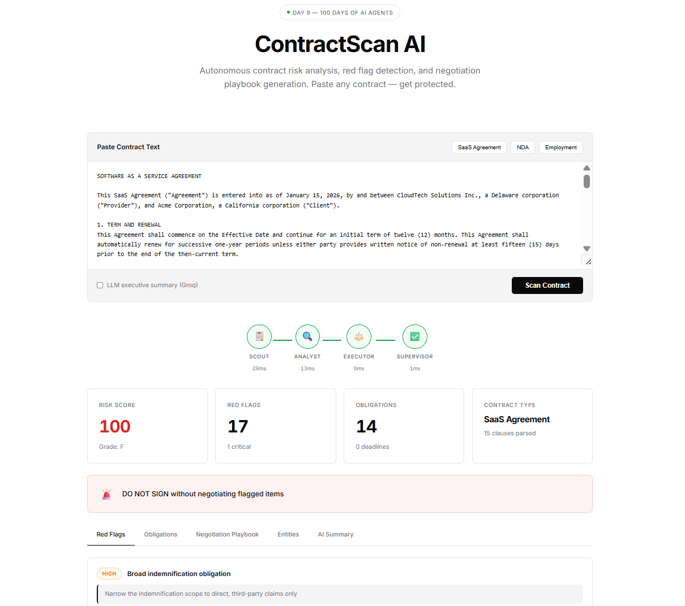

# ContractScan AI



**Day 9 of 100 Days, 100 AI Agents** — Autonomous contract risk analysis agent that reads any contract, detects red flags, identifies missing protections, and generates a negotiation playbook. Built with a 4-agent swarm architecture.

## What It Does

Paste any contract (NDA, SaaS agreement, employment contract, service agreement) and ContractScan AI will:

- Parse and classify 60+ clause types (termination, liability, indemnification, IP, non-compete, data protection, etc.)
- Detect 80+ red flags across 12 risk categories with severity scoring
- Identify missing clauses based on contract type expectations
- Extract entities: parties, dates, amounts, durations, percentages
- Generate a prioritized negotiation playbook with suggested replacement language
- Score overall risk (0-100) with letter grade (A to F)
- Produce an AI executive summary with sign/negotiate/walk-away recommendation

**Human equivalent**: 2-4 hours (junior lawyer) or $500-$1,500 (outside counsel). ContractScan does it in under 3 seconds.

## System Architecture

```
CONTRACT TEXT
     |
     v
+------------------+     +------------------+     +------------------+     +------------------+
|   SCOUT (Agent A) | --> | ANALYST (Agent B) | --> | EXECUTOR (Agent C)| --> | SUPERVISOR (D)   |
|   Zero LLM        |     |   Zero LLM        |     |   Hybrid           |     |   Validation      |
|                    |     |                    |     |                    |     |                    |
| - Clause parsing   |     | - 80+ red flags    |     | - Playbook gen     |     | - Quality checks   |
| - Entity extraction|     | - Missing clauses  |     | - Suggested lang   |     | - Confidence score |
| - Type detection   |     | - Obligation scan  |     | - LLM exec summary |     | - Pipeline timing  |
| - 60+ clause types |     | - Risk scoring     |     | - Recommendations  |     | - Consistency QA   |
+------------------+     +------------------+     +------------------+     +------------------+
```

**Anti-Wrapper Moat**: The core engine (Scout + Analyst + Executor playbook) works entirely without any API key. The LLM (Groq/Llama) is used only for the optional executive summary — everything else is deterministic, rule-based analysis.

## Quick Start

```bash
cd Day-09-ContractScan
npm install
cp .env.example .env    # add your GROQ_API_KEY (optional — works without it)
npm start               # http://localhost:3000
```

## API

```bash
POST /api/analyze
Content-Type: application/json

{
  "contract": "MASTER SERVICE AGREEMENT...",
  "mode": "offline"   // optional: skip LLM call
}
```

**Response** includes: `contractType`, `risk` (score/grade/level), `redFlags`, `missingClauses`, `obligations`, `playbook` (negotiation items with suggested language), `recommendation`, `executiveSummary`, `confidence`, `pipeline` (timing per agent).

## Tech Stack

- **Runtime**: Node.js (ES Modules)
- **LLM**: Groq API with Llama 3.3 70B (optional — core works offline)
- **Frontend**: Vanilla HTML/CSS/JS, Inter font, black/white palette
- **Deployment**: Vercel Serverless

## File Structure

```
Day-09-ContractScan/
  api/analyze.js          — Vercel serverless endpoint
  lib/scout.js            — Contract parser & clause extractor (194 lines, zero LLM)
  lib/analyst.js          — Red flag engine & risk scorer (215 lines, zero LLM)
  lib/executor.js         — Playbook generator + LLM summary (163 lines)
  lib/supervisor.js       — Quality validation & confidence (97 lines)
  public/index.html       — Premium dashboard UI (398 lines)
  server.js               — Express local dev server
  package.json, vercel.json, .env.example
```

**Total**: ~1,185 lines of production code.

## Sample Contracts Included

The UI ships with 3 built-in sample contracts for instant demo:

1. **SaaS Agreement** — Cloud software subscription with typical vendor-favorable terms
2. **Non-Disclosure Agreement** — Mutual NDA with common confidentiality provisions
3. **Employment Contract** — Standard employment agreement with restrictive covenants

## Risk Scoring

| Grade | Score  | Meaning                                    |
|-------|--------|--------------------------------------------|
| A     | 0-10   | Low risk, generally safe to sign           |
| B     | 11-20  | Minor issues, review flagged items         |
| C     | 21-35  | Moderate risk, negotiate before signing    |
| D     | 36-50  | High risk, significant concerns            |
| F     | 51-100 | Critical risk, do not sign without changes |

## License

MIT
